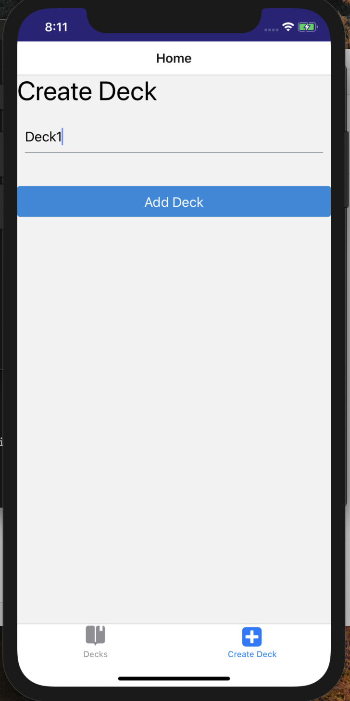
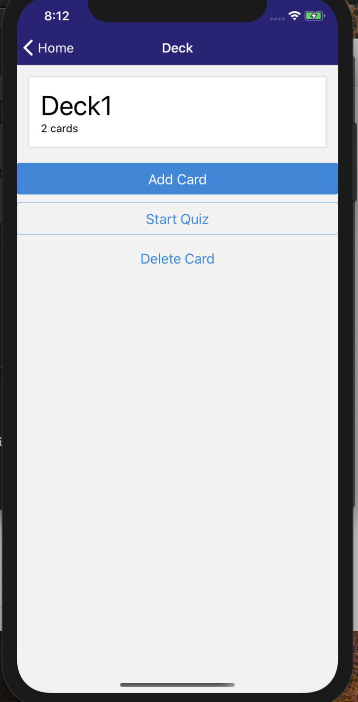
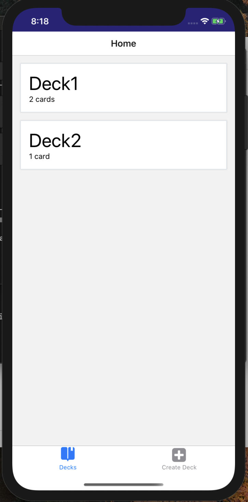

# Mobile Flashcards

Mobile FlashCards is a simple app that allows you to add question , answer to your deck and later you can quiz and learn.

This app is the project required for [Udacity's React Nanodegree program](https://www.udacity.com/course/react-nanodegree--nd019).


## Installation

Clone the repository, change directories, and use NPM to install the dependencies.

```bash
$ git clone https://github.com/ishantgit/would-you-rather.git
$ cd would-you-rather
$ npm install
```

## Usage

The project can be run on Android

- `npm run android`

The project can be run on ios

- `npm run ios`

## Screenshots


 
 
